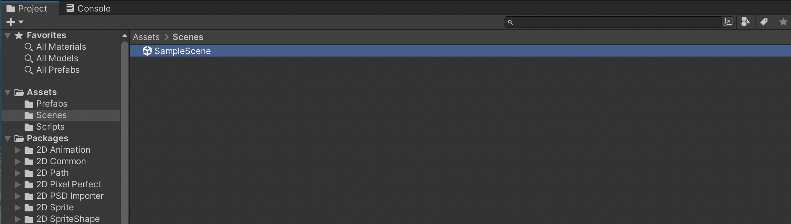
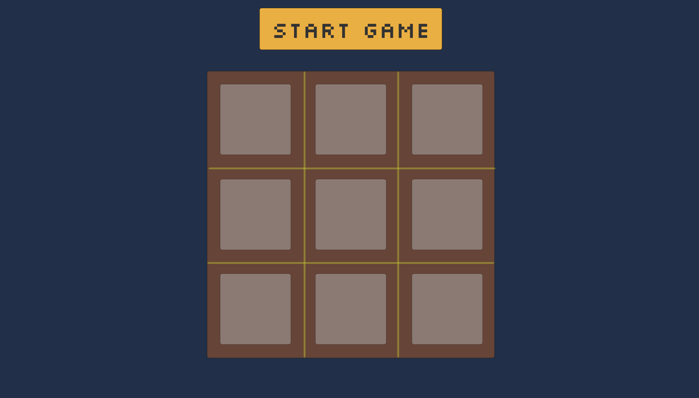
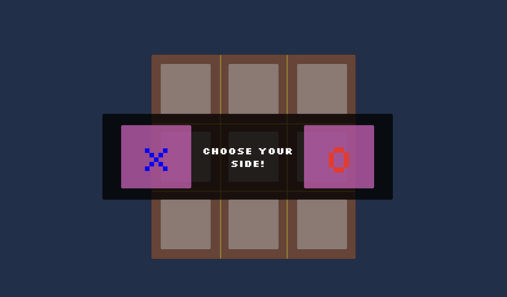
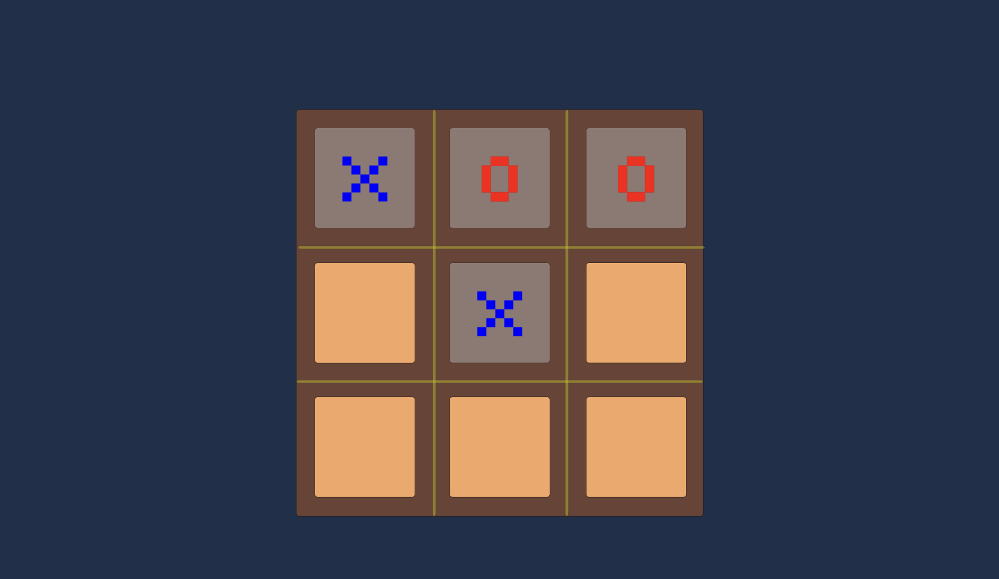
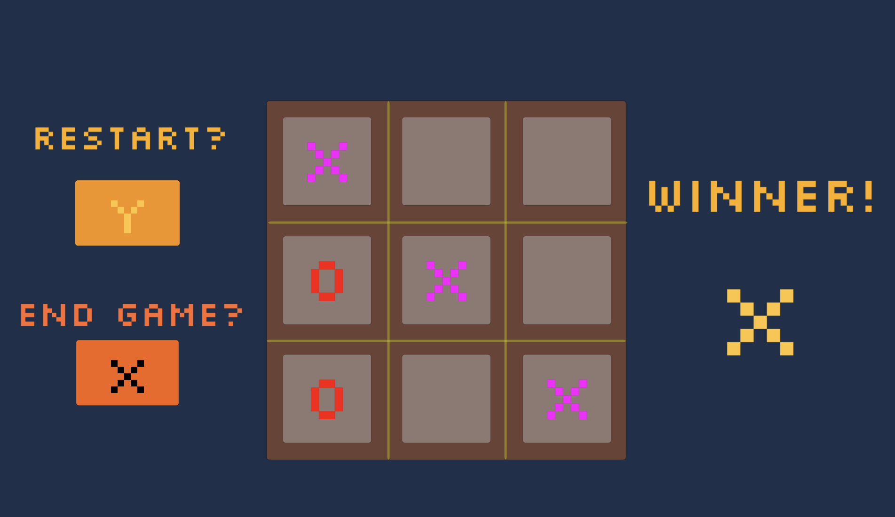
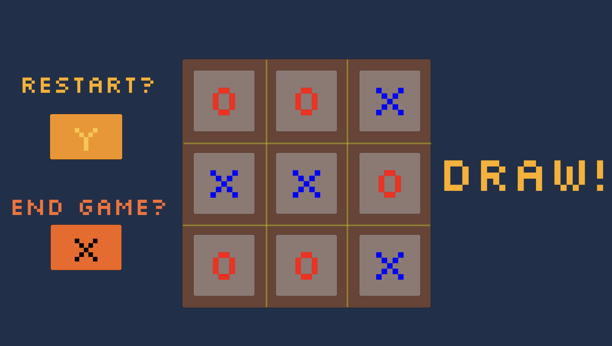

### Tic Tac Toe - Unity / C#

A Simple Tic Tac Toe game created with Unity / C#. Choose a side (X or O) and battle against the computer to win, lose, or draw!

### Link to play via WebGL (Browser)

To play this game on your browser, click the following link: [https://blakewood84.github.io/unity-tic_tac_toe/Builds/WebGL/index.html](https://blakewood84.github.io/unity-tic_tac_toe/Builds/WebGL/index.html)
### Setup Instructions / Play Game

1. Please load this project folder with Unity Hub: Open -> Add Project From Disk
2. Once the Project has loaded and Unity is opened, please check the Assets Folder, and find the Scene Folder. Double Click on SampleScene and the project should open:

3. Click the Play Button and the game should play!

--- 

### Screenshots

1. Start Game:

2. In-Play:

3. Winner / Draw:

